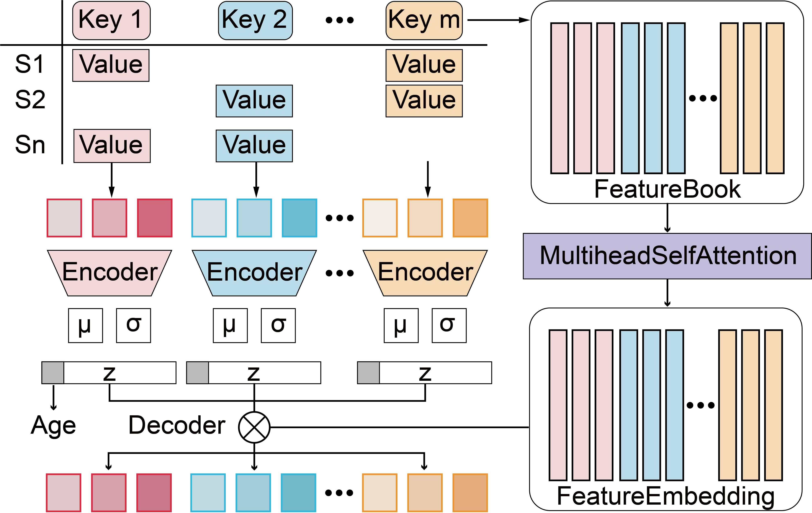

# AURORA: AI Unification and Reconstruction of Omics Reassembly Atlas



## Package: `AURORA`

AURORA is a Python package for multimodal omics integration and cross-modality reconstruction.

### Requirements

+ Linux/UNIX/Windows system
+ Python >= 3.8
+ torch

### Create environment

```
conda create -n AURORA python
conda activate AURORA
```

### Installation

Install from the project root:

```
pip install .
```

Alternatively, you can also install the package directly from GitHub:

```
pip install git+https://github.com/JackieHanLab/Aurora.git
```

### Environment has been tested

`AURORA.yml`

## Usage

### Step 1: Configure data

```py
import aurora

modalityA_h5ad.layers['input'] = modalityA_h5ad.X
aurora.configure_dataset(modalityA_h5ad, use_layers = 'input', use_uid = <sample_ID>,use_labels = <Age_label>)
modalityB_h5ad.layers['input'] = modalityB_h5ad.X
aurora.configure_dataset(modalityB_h5ad, use_layers = 'input', use_uid = <sample_ID>,use_labels = <Age_label>)

modalityN_h5ad.layers['input'] = modalityN_h5ad.X
aurora.configure_dataset(modalityN_h5ad, use_layers = 'input', use_uid = <sample_ID>,use_labels = <Age_label>)

all_features = modalityA_h5ad.var_names.to_list() + modalityB_h5ad.var_names.to_list() + modalityN_h5ad.var_names.to_list()
```

#### Input:

+ `modalityX_h5ad`: an `AnnData` object of modality X.
+ `<sample_ID>`: the name of the **unique** sample_ID column in `adata.obs`.
+ `<Age_label>`: the name of the **numeric** Age column in `adata.obs`.

### Step 2: Train the model

```py
aurora_model = aurora.fit_model(
    adatas = {"modality_A": modalityA_h5ad, 
              "modality_B": modalityB_h5ad,
              ...
              "modality_N": modalityN_h5ad}, 
    features = <features>,
    project_name = <project_name>
)
aurora_model.save("my_model.dill")
```

#### Input:

+ `adatas`: a list of configured `AnnData` object.
+ `features`: a list of all variable names of `adatas`, like: `all_features`
+ `project_name`: the model will be saved in a folder named <project_name>. Default: `my_aurora`

### Step 3: Generation with the model

```py
import aurora
from aurora import load_model

#load model
aurora_model = load_model("my_aurora.dill")
#get sample embeddings from modality A
modalityA_h5ad.obsm["X_latent"] = aurora_model.encode_data("modality_A", modalityA_h5ad)
#generate all modality data
modality =aurora_model.net.x2z.keys()
for modality_ in modality:
    modalityA_h5ad.obsm["X_"+modality_] = aurora_model.decode_data(modality_, modalityA_h5ad,"modality_A")
```

## Important Notice: Limited Edition & Commercial Services

This repository hosts a **basic, stripped-down version** of `AURORA` intended solely for academic research, demonstration, and non-commercial testing.

Access to the **complete official version**, advanced functionalities, official Agent demonstrations, priority technical support, tailored training workshops, and custom software development is available exclusively through commercial licensing.
Enterprise users can choose from flexible payment models, including **subscription-based plans** and **pay-per-use services**.

To discuss licensing options or request a full version, please contact:
contact@beyondagetec.com

## Cite AURORA:

[Chen, J., et al. A Generative AI Framework Unifies Human Multi-omics to Model Aging, Metabolic Health and Intervention Response. Cell Metab. (2026)]
